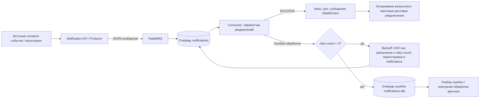

# message-broker-vkr

`message-broker-vkr` — учебный проект для ВКР, который показывает базовый паттерн асинхронного обмена сообщениями через RabbitMQ между двумя сервисами: отправителем (producer) и обработчиком (consumer).

Главная цель проекта — продемонстрировать надежную доставку и обработку событий: producer публикует уведомления в очередь `notifications`, consumer читает их, обрабатывает и подтверждает (`ack`). Если сообщение невалидное или при обработке возникает ошибка, оно не теряется, а переносится в отдельную очередь ошибок `notifications.dlq` (Dead Letter Queue).

## Зачем проект реализован

Проект нужен как практический пример архитектуры, где сервисы слабо связаны друг с другом:
- API/producer не зависит от скорости и состояния consumer.
- Сообщения буферизуются в брокере и обрабатываются отдельно.
- Ошибочные сообщения изолируются в DLQ для последующего анализа.

Такой подход используется в реальных системах уведомлений, интеграций между микросервисами, обработке событий и фоновых задач.

## Как устроен проект

Основные файлы проекта:
- `app/api_service/main.py` — FastAPI API.
- `app/api_service/rabbit.py` — публикация сообщений в RabbitMQ.
- `app/consumer_service/consumer.py` — обработка сообщений, retry и DLQ.
- `tests/send_many.py` — массовая проверка.
- `docker-compose.yml` — запуск RabbitMQ, API и consumer.
- `Dockerfile` — сборка Python-сервисов.

## Архитектура проекта



## Логика работы сообщений

1. Producer сериализует `dict` в JSON bytes и публикует сообщение в `notifications`.
2. Очередь `notifications` создается как `durable`, сообщение публикуется с `delivery_mode=2` (persistent).
3. Consumer читает сообщения из `notifications`.
4. Если JSON разобран успешно и событие валидное:
- выводит `SUCCESS ...` в stdout
- выполняет `basic_ack`
5. Если JSON некорректный или возникает ошибка обработки:
- consumer выполняет повторные попытки обработки сообщения (включая симуляцию `event == "fail"`);
- количество попыток хранится в заголовке x-retry-count;
- после 3 неудачных попыток сообщение отправляется в notifications.dlq;
- исходное сообщение подтверждается через basic_ack, чтобы избежать бесконечного повторения.

## Переменные окружения

Для подключения к RabbitMQ используются переменные окружения:
- `RABBITMQ_HOST` (по умолчанию `localhost`)
- `RABBITMQ_PORT` (по умолчанию `5672`)
- `RABBITMQ_USER` (по умолчанию `guest`)
- `RABBITMQ_PASS` (по умолчанию `guest`)

## Быстрый запуск

1. Собрать и запустить всю систему:

```bash
docker compose up --build -d
```

2. Проверить состояние контейнеров:

```bash
docker compose ps
```

3. Открыть RabbitMQ UI:
- `http://localhost:15672`
- логин/пароль: `guest` / `guest`

4. Открыть Swagger UI:
- `http://127.0.0.1:8000/docs`

5. Смотреть логи consumer:

```bash
docker compose logs -f consumer
```

## Запуск API

Для запуска FastAPI-сервиса используется команда:

```bash
uvicorn app.api_service.main:app --reload
```

После запуска API будет доступен по адресу:

- Swagger UI: `http://127.0.0.1:8000/docs`
- Health-check: `http://127.0.0.1:8000/health`

Проверка `/health` должна вернуть:

```json
{
  "status": "ok"
}
```

## Отправка уведомления через API

Endpoint `POST /notify` принимает JSON-сообщение и публикует его в очередь RabbitMQ `notifications`.

Пример запроса:

```bash
curl -X POST "http://127.0.0.1:8000/notify" \
  -H "Content-Type: application/json" \
  -d '{
    "event": "packet_loss_alert",
    "source": "router-01",
    "severity": "critical",
    "text": "Потери пакетов выше нормы",
    "payload": {
      "packet_loss": 18,
      "threshold": 10
    }
  }'
```

Пример ответа API:

```json
{
  "status": "queued",
  "id": "uuid-сообщения"
}
```

## Проверка результата

После отправки запроса на `/notify` сообщение попадает в очередь `notifications`.

Если consumer запущен:

```bash
python -m app.consumer_service.consumer
```

то он получает сообщение, обрабатывает его и выводит:

```text
SUCCESS
```

После успешной обработки consumer отправляет подтверждение `basic_ack`, и сообщение удаляется из очереди.

Если отправить сообщение с полем:

```json
{
  "event": "fail"
}
```

consumer выполнит повторные попытки обработки:

```text
RETRY 1
RETRY 2
RETRY 3
DLQ
```

После трёх неудачных попыток сообщение будет перенесено в очередь ошибок `notifications.dlq`.

## Проверка сценария ошибки и DLQ

Чтобы проверить перенос в DLQ, отправьте сообщение с `event = "fail"`.
Текущая CLI-версия producer уже отправляет такое тестовое сообщение.

Ожидаемый результат:
- в логе consumer появятся строки `RETRY 1`, `RETRY 2`, `RETRY 3`, затем `DLQ`;
- сообщение исчезнет из `notifications`;
- сообщение появится в `notifications.dlq`.

## Массовая проверка обработки сообщений

Для массовой проверки можно использовать тестовый скрипт `tests/send_many.py`. Он отправляет 25 сообщений в RabbitMQ:
- 20 корректных сообщений с `event="packet_loss_alert"`;
- 5 ошибочных сообщений с `event="fail"`.

Перед чистым тестом желательно открыть RabbitMQ UI и очистить очередь `notifications.dlq`, если в ней остались старые сообщения. Это позволит точно проверить, что после запуска теста в DLQ попали только новые ошибочные сообщения.

Запуск скрипта:

```bash
python -m tests.send_many
```

Ожидаемый вывод скрипта:

```text
Sent 25 messages: 20 normal, 5 failed
```

Ожидаемые логи consumer:
- для 20 корректных сообщений появится `SUCCESS`;
- для 5 ошибочных сообщений появятся `RETRY 1`, `RETRY 2`, `RETRY 3` и затем `DLQ`.

Ожидаемый результат в RabbitMQ UI после обработки:
- `notifications` Ready = `0`;
- `notifications.dlq` Ready = `5`.

## Результаты тестирования

В рамках проверки проекта были выполнены основные сценарии работы API, RabbitMQ, consumer-сервиса, retry-механики и DLQ.

Проверенные сценарии:
- `GET /health` возвращает `{"status": "ok"}` и подтверждает, что API-сервис запущен.
- `POST /notify` возвращает `{"status": "queued", "id": "..."}` и отправляет сообщение в очередь RabbitMQ `notifications`.
- Consumer обрабатывает корректные сообщения и выводит `SUCCESS` в логах.
- Ошибочные сообщения с `event="fail"` проходят `RETRY 1`, `RETRY 2`, `RETRY 3`, после чего попадают в очередь `notifications.dlq`.

Результат массового теста:
- скрипт `tests/send_many.py` отправляет 25 сообщений;
- 20 корректных сообщений обработаны успешно;
- 5 ошибочных сообщений после повторных попыток попали в DLQ;
- после завершения обработки `notifications` Ready = `0`, `notifications.dlq` Ready = `5`.

| Сценарий | Ожидаемый результат | Фактический результат |
| --- | --- | --- |
| Проверка `GET /health` | API возвращает `{"status": "ok"}` | API вернул `{"status": "ok"}` |
| Отправка сообщения через `POST /notify` | API возвращает `{"status": "queued", "id": "..."}` и публикует сообщение в `notifications` | Сообщение поставлено в очередь `notifications` |
| Обработка корректных сообщений consumer-сервисом | В логах появляется `SUCCESS`, сообщение подтверждается через `basic_ack` | Корректные сообщения обработаны, в логах появился `SUCCESS` |
| Обработка ошибочных сообщений `event="fail"` | Сообщения проходят `RETRY 1`, `RETRY 2`, `RETRY 3` и переносятся в `notifications.dlq` | 5 ошибочных сообщений перенесены в `notifications.dlq` |
| Массовый тест `tests/send_many.py` | 20 сообщений обработаны успешно, 5 сообщений попали в DLQ, `notifications` Ready = `0`, `notifications.dlq` Ready = `5` | Результат соответствует ожидаемому: `notifications` Ready = `0`, `notifications.dlq` Ready = `5` |


